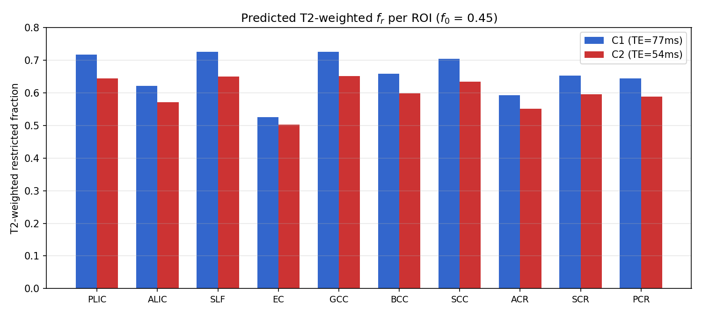
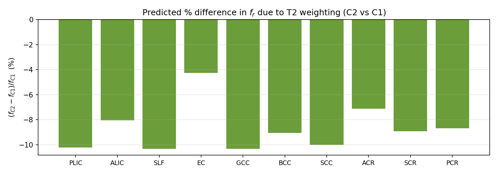
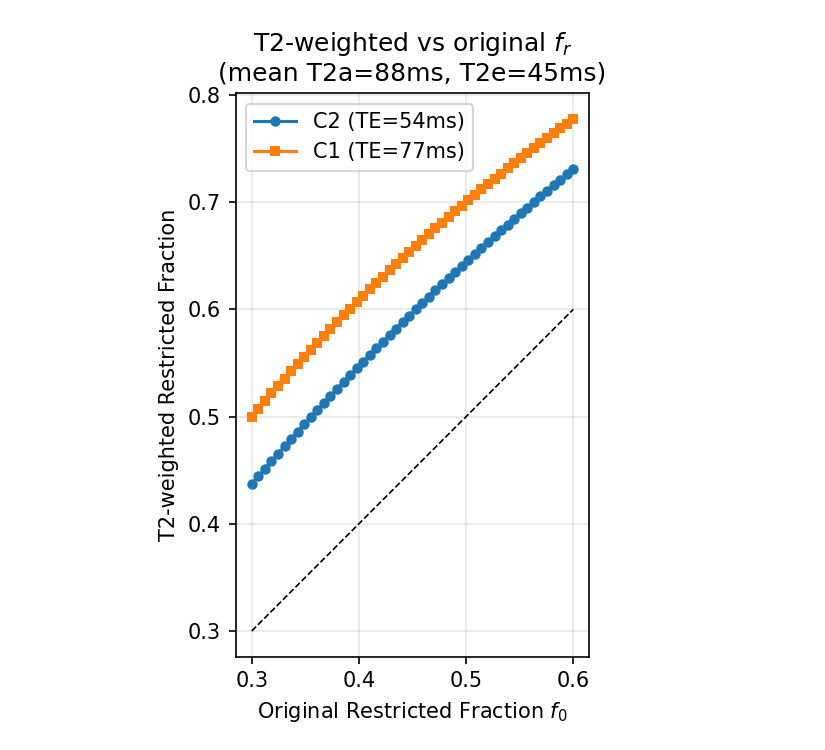
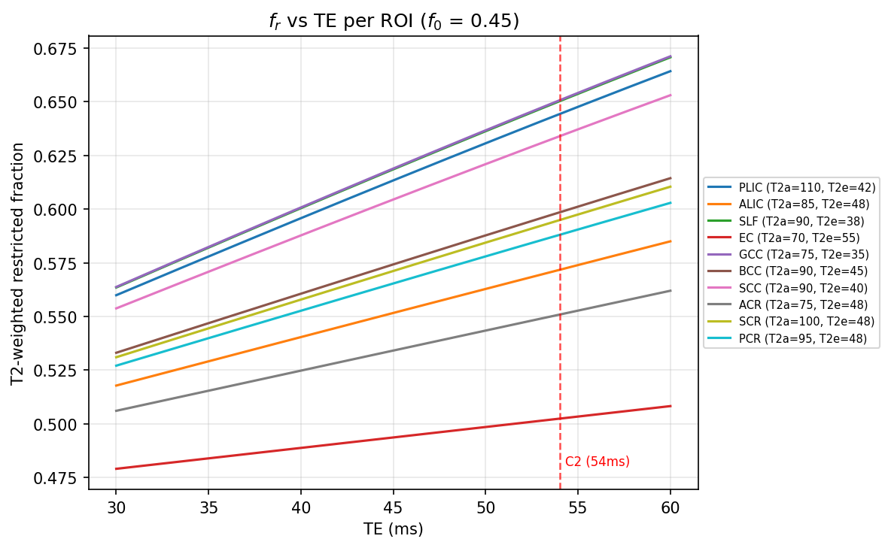

## T2-weighted volume fraction analysis

### Background

The restricted volume fraction ($f_r$) estimated by AxCaliber-SMT is not the true (non-T2-weighted) intra-axonal water fraction $f_0$, but rather a T2-decay-weighted apparent fraction that depends on echo time (TE). Because intra-axonal and extra-axonal compartments have different T2 relaxation times, the apparent fraction shifts with TE according to (Veraart et al., 2018):

$$f_r(\text{TE}) = \frac{f_0 \, e^{-\text{TE}/T_{2}^{a}}}{f_0 \, e^{-\text{TE}/T_{2}^{a}} + (1 - f_0) \, e^{-\text{TE}/T_{2}^{e}}}$$

where $T_2^a$ and $T_2^e$ are the intra-axonal and extra-axonal transverse relaxation times, respectively.

Since $T_2^a > T_2^e$ in white matter (Veraart et al., 2018), the extra-axonal signal decays faster with increasing TE. At longer TE, the extra-axonal contribution is more suppressed, inflating the apparent restricted fraction. Because C2 operates at a shorter TE (54 ms) than C1 (77 ms), C2 retains more extra-axonal signal relative to intra-axonal signal, resulting in systematically lower $f_r$ estimates compared to C1 for the same underlying tissue.

### Method

We computed the predicted T2-weighted restricted fraction for 10 major white matter ROIs at both echo times, using a two-compartment model ($f_{\text{csf}} = 0$) with compartmental T2 values read from Figure 5 of Veraart et al. (2018) and a representative non-T2-weighted fraction of $f_0 = 0.45$. The two-compartment assumption follows Veraart et al. (2018) and Kaden et al. (2016); CSF has $T_2 \approx 2000$ ms at 3T, producing negligible signal change between TE = 54 ms and 77 ms (~1% difference).

The ROIs and their T2 values are:

| ROI  | $T_2^a$ (ms) | $T_2^e$ (ms) | $T_2^a / T_2^e$ |
|------|:---:|:---:|:---:|
| PLIC | 110 | 42 | 2.62 |
| ALIC |  85 | 48 | 1.77 |
| SLF  |  90 | 38 | 2.37 |
| EC   |  70 | 55 | 1.27 |
| GCC  |  75 | 35 | 2.14 |
| BCC  |  90 | 45 | 2.00 |
| SCC  |  90 | 40 | 2.25 |
| ACR  |  75 | 48 | 1.56 |
| SCR  | 100 | 48 | 2.08 |
| PCR  |  95 | 48 | 1.98 |

### Results

| ROI  | $f_r$ (C2, TE=54 ms) | $f_r$ (C1, TE=77 ms) | C2 vs C1 |
|------|:---:|:---:|:---:|
| PLIC | 0.645 | 0.717 | −11.2% |
| ALIC | 0.572 | 0.621 | −8.6%  |
| SLF  | 0.650 | 0.725 | −11.5% |
| EC   | 0.503 | 0.524 | −4.2%  |
| GCC  | 0.651 | 0.725 | −11.5% |
| BCC  | 0.599 | 0.655 | −9.4%  |
| SCC  | 0.634 | 0.706 | −11.3% |
| ACR  | 0.551 | 0.592 | −7.5%  |
| SCR  | 0.595 | 0.652 | −9.7%  |
| PCR  | 0.588 | 0.643 | −9.4%  |
| **Mean** | **0.599** | **0.656** | **−9.4%** |

---

### Figure 1. Predicted T2-weighted $f_r$ per ROI (C1 vs C2)

C1 (blue, TE = 77 ms) consistently yields higher apparent $f_r$ than C2 (red, TE = 54 ms) across all ROIs, because the longer TE suppresses more extra-axonal signal.

---

### Figure 2. Predicted percentage difference (C2 − C1)

The T2 weighting effect predicts that C2 yields 4–12% lower restricted fractions than C1 (mean −9.4%). The effect is largest in ROIs with the greatest $T_2^a / T_2^e$ ratio (e.g., SLF, GCC, SCC: ratio > 2.1) and smallest where the two compartmental T2 values are closer (e.g., EC: ratio = 1.27).

---

### Figure 3. T2-weighted vs original restricted fraction

Both C1 and C2 curves lie above the identity line—T2 weighting inflates the apparent restricted fraction at any $f_0$. The vertical gap between the two curves represents the systematic C1–C2 bias due to TE difference.

---

### Figure 4. $f_r$ vs TE (30–60 ms) per ROI

Each curve shows how the apparent restricted fraction decreases with shorter TE for a given ROI. The red dashed line marks the C2 echo time (54 ms). ROIs with higher $T_2^a / T_2^e$ ratios (e.g., PLIC, SLF, GCC) show steeper slopes, meaning they are more sensitive to TE differences between protocols.

---

### Key findings

1. **Direction consistent**: T2 weighting predicts C2 < C1 for all ROIs, matching observed in-vivo pattern.
2. **Mean difference**: T2 model predicts a mean −9.4% difference, comparable to observed ~8–10% in-vivo.
3. **ROI dependence**: The effect scales with the $T_2^a / T_2^e$ ratio—ROIs with greater compartmental T2 contrast show larger C1–C2 discrepancy.
4. **Partial explanation**: T2 weighting is one contributing factor to the observed C1–C2 gap. Additional factors (SNR: 18 vs 38, b-value range, gradient strength) also contribute, particularly for tracts like CST where the in-vivo difference exceeds the T2 prediction.

### References

Kaden, E., Kelm, N. D., Carson, R. P., Does, M. D., & Alexander, D. C. (2016). Multi-compartment microscopic diffusion imaging. *NeuroImage*, 139, 346–359. https://doi.org/10.1016/j.neuroimage.2016.06.002

Veraart, J., Novikov, D. S., & Fieremans, E. (2018). TE dependent Diffusion Imaging (TEdDI) distinguishes between compartmental T2 relaxation times. *NeuroImage*, 182, 360–369. https://doi.org/10.1016/j.neuroimage.2017.09.030
