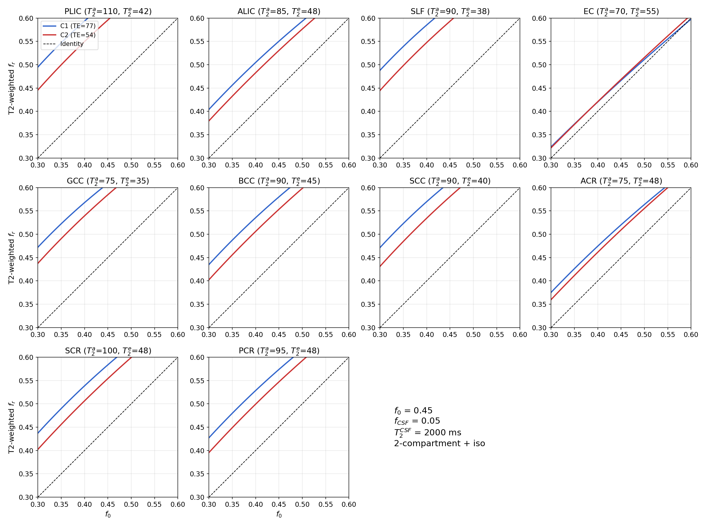

## T2-weighted volume fraction analysis

### Background

The restricted volume fraction ($f_r$) estimated by AxCaliber-SMT is not the true (non-T2-weighted) intra-axonal water fraction $f_0$, but rather a T2-decay-weighted apparent fraction that depends on echo time (TE). Because intra-axonal and extra-axonal compartments have different T2 relaxation times, the apparent fraction shifts with TE according to (Veraart et al., 2018):

$$f_r(\text{TE}) = \frac{f_0 \, e^{-\text{TE}/T_{2}^{a}}}{f_0 \, e^{-\text{TE}/T_{2}^{a}} + f_e \, e^{-\text{TE}/T_{2}^{e}} + f_{\text{csf}} \, e^{-\text{TE}/T_{2}^{\text{csf}}}}$$

where $T_2^a$ and $T_2^e$ are the intra-axonal and extra-axonal transverse relaxation times, $f_e = 1 - f_0 - f_{\text{csf}}$ is the extra-axonal fraction, and $f_{\text{csf}}$ is the isotropic (CSF-like) compartment fraction with $T_2^{\text{csf}} \approx 2000$ ms at 3T.

Since $T_2^a > T_2^e$ in white matter (Veraart et al., 2018), the extra-axonal signal decays faster with increasing TE. At longer TE, the extra-axonal contribution is more suppressed, inflating the apparent restricted fraction. Because C2 operates at a shorter TE (54 ms) than C1 (77 ms), C2 retains more extra-axonal signal relative to intra-axonal signal, resulting in systematically lower $f_r$ estimates compared to C1 for the same underlying tissue.

### Method

We computed the predicted T2-weighted restricted fraction for 10 major white matter ROIs at both echo times, using compartmental T2 values read from Figure 5 of Veraart et al. (2018), a representative non-T2-weighted fraction of $f_0 = 0.45$, and an isotropic compartment fraction $f_{\text{csf}} = 0.05$ with $T_2^{\text{csf}} = 2000$ ms (Veraart et al., 2018; Kaden et al., 2016).

The ROIs and their T2 values are:

| ROI  | $T_2^a$ (ms) | $T_2^e$ (ms) | $T_2^a / T_2^e$ |
|------|:---:|:---:|:---:|
| PLIC | 110 | 42 | 2.62 |
| ALIC |  85 | 48 | 1.77 |
| SLF  |  90 | 38 | 2.37 |
| EC   |  70 | 55 | 1.27 |
| GCC  |  75 | 35 | 2.14 |
| BCC  |  90 | 45 | 2.00 |
| SCC  |  90 | 40 | 2.25 |
| ACR  |  75 | 48 | 1.56 |
| SCR  | 100 | 48 | 2.08 |
| PCR  |  95 | 48 | 1.98 |

### Results

| ROI  | $f_r$ (C2, TE=54 ms) | $f_r$ (C1, TE=77 ms) | C2 vs C1 |
|------|:---:|:---:|:---:|
| PLIC | 0.596 | 0.636 | −6.3% |
| ALIC | 0.530 | 0.550 | −3.6% |
| SLF  | 0.593 | 0.627 | −5.3% |
| EC   | 0.469 | 0.466 | +0.5% |
| GCC  | 0.585 | 0.609 | −4.0% |
| BCC  | 0.553 | 0.580 | −4.6% |
| SCC  | 0.581 | 0.612 | −5.2% |
| ACR  | 0.509 | 0.520 | −2.1% |
| SCR  | 0.554 | 0.584 | −5.1% |
| PCR  | 0.547 | 0.574 | −4.6% |
| **Mean** | **0.552** | **0.576** | **−4.0%** |

Across all ROIs, the T2 weighting effect predicts that C2 yields 2–6% lower restricted fractions than C1 (mean −4.0%). The effect is largest in ROIs with the greatest $T_2^a / T_2^e$ ratio (e.g., PLIC, SLF, SCC) and smallest where the two compartmental T2 values are closer (e.g., EC).

### Figure. T2-weighted vs original restricted fraction per ROI

For each ROI, the blue curve (C1, TE = 77 ms) lies above the red curve (C2, TE = 54 ms)—both inflated above the identity line (dashed black). The vertical gap between curves represents the systematic C1–C2 bias due to TE difference. ROIs with larger $T_2^a / T_2^e$ ratios (e.g., PLIC: 2.62, SLF: 2.37) show wider separation than ROIs with similar compartmental T2 values (e.g., EC: 1.27).

### References

Kaden, E., Kelm, N. D., Carson, R. P., Does, M. D., & Alexander, D. C. (2016). Multi-compartment microscopic diffusion imaging. *NeuroImage*, 139, 346–359. https://doi.org/10.1016/j.neuroimage.2016.06.002

Veraart, J., Novikov, D. S., & Fieremans, E. (2018). TE dependent Diffusion Imaging (TEdDI) distinguishes between compartmental T2 relaxation times. *NeuroImage*, 182, 360–369. https://doi.org/10.1016/j.neuroimage.2017.09.030
