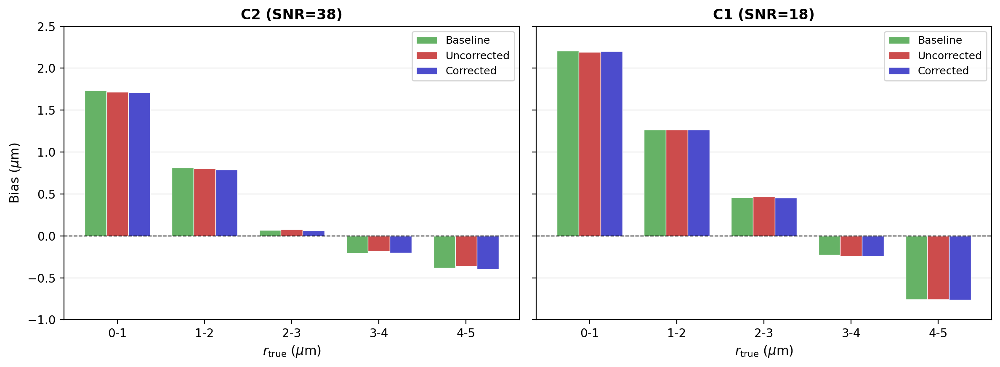

## Gradient direction-dependent noise propagation analysis (b-vector GNL)

### Background

Gradient nonlinearity (GNL) affects diffusion MRI measurements by spatially varying the effective gradient field. The standard scalar b-value correction accounts for changes in gradient *magnitude* (b-scaling), but GNL also rotates the effective gradient direction. For the Connectome scanners, which use high-performance gradient coils, these spatial deviations can be substantial. This analysis quantifies the impact of the full gradient deviation tensor -- including both b-scaling and b-rotation -- on AxCaliber-SMT axon radius estimates, and evaluates whether a scalar b\_scale correction is sufficient.

### Method

#### Gradient deviation model

For each voxel, the gradient deviation is described by a 3x3 tensor **L**, obtained from FSL's `calc_grad_perc_dev` applied to the gradient coil's nonlinearity field. The effective gradient for a nominal direction g is:

> g\_eff = (I + L) g = M g

This changes both the gradient magnitude (|g\_eff|) and direction. The direction-specific b-scaling factor is |g\_eff|^2, and the scalar (direction-averaged) b-scale used for correction is:

> b\_scale = tr(M'M) / 3

#### Signal generation

For each protocol (C2, C1), we load the actual diffusion gradient tables (bvec/bval files) and the gradient deviation maps (grad\_dev). The protocol uses 16 b-value shells with delta = 8 ms, Delta = 19 ms (short) or Delta = 49 ms (long), spanning b = 0.05-17.8 ms/um^2. Each shell has 32 or 64 gradient directions.

We sample N = 2000 white-matter voxels from the WM mask (excluding CSF and GM), and for each voxel draw random ground-truth parameters: axon radius r in [0.1, 5] um, intra-axonal fraction f in [0.5, 1], CSF fraction fcsf in [0, 0.2], and extra-axonal radial diffusivity DeR in [0.5, 1.5] um^2/ms.

For each gradient direction g\_k in shell s, the single-fiber signal is:

> S\_k = (1 - fcsf) \[ f \* Sa(g\_k) + (1-f) \* Se(g\_k) \] + fcsf \* exp(-b\_s \* Dcsf)

where:
- **Sa** is the intra-axonal (restricted cylinder) signal using the Van Gelderen model with 10 Bessel zeros, depending on r, D0, Da, delta, Delta, and the perpendicular gradient component g\_perp^2
- **Se** is the extra-axonal (zeppelin) signal: Se = exp(-b \* (DeR + (DeL - DeR) \* cos^2(theta)))
- **theta** is the angle between the gradient direction and the fiber axis (z-axis)

The powder-averaged signal per shell is the mean over all directions in that shell.

Fixed diffusivities: D0 = 2, Da = 1.7, DeL = 1.7, Dcsf = 3 um^2/ms. SNR: 38 (C2) and 18 (C1).

#### Three scenarios

For each voxel, a single Rician noise realization is shared across all three scenarios to isolate the effect of GNL:

1. **Baseline**: Signal generated with nominal gradient directions (no GNL). Fit with nominal b-values.
2. **Uncorrected**: Signal generated with GNL-perturbed gradients (per-direction b-scaling and b-rotation via M). Fit with nominal b-values (no correction).
3. **Corrected**: Same GNL signal as (2). Fit with scalar-corrected b-values (b\_corr = b \* b\_scale).

The GNL signal (scenarios 2-3) applies the full M matrix to all gradient directions simultaneously:
- Effective gradient: g\_eff = M \* g\_k
- Direction-specific b-scaling: b\_eff\_k = b\_s \* |g\_eff|^2
- Rotated angle: theta\_k = arccos(|g\_eff\_hat \* z|)

#### Fitting

All fitting uses `AxCaliberSMT.mcmc` from the C2 protocol design library (Lee et al.), with the Van Gelderen restricted diffusion model and 5 MCMC restarts. This is identical to the fitting method used in the scalar b-scale noise propagation analysis, ensuring a fair comparison. The only difference between the two analyses is how GNL affects the synthetic signal: scalar b-scaling only (b-scale analysis) versus full directional perturbation (this analysis).

### Results

#### Data summary

| Protocol | WM voxels | b\_scale range | Directions per shell |
|----------|-----------|----------------|----------------------|
| C2 (Gmax=495 mT/m, SNR=38) | 55,358 | [0.778, 1.181] | 32 or 64 |
| C1 (Gmax=290 mT/m, SNR=18) | 68,490 | [0.817, 1.099] | 32 or 64 |

#### Bias stratified by axon radius

For both C2 and C1, the three scenarios (Baseline, Uncorrected, Corrected) produce nearly overlapping bars at every radius bin.

| Protocol | r (um) | N | Baseline | Uncorrected | Corrected |
|----------|:---:|:---:|:---:|:---:|:---:|
| C2 | 0-1 | 105 | +1.736 | +1.717 | +1.711 |
| C2 | 1-2 | 149 | +0.815 | +0.803 | +0.792 |
| C2 | 2-3 | 207 | +0.071 | +0.079 | +0.066 |
| C2 | 3-4 | 317 | -0.208 | -0.183 | -0.202 |
| C2 | 4-5 | 294 | -0.383 | -0.363 | -0.396 |
| C1 | 0-1 | 82 | +2.209 | +2.194 | +2.201 |
| C1 | 1-2 | 112 | +1.266 | +1.268 | +1.264 |
| C1 | 2-3 | 120 | +0.459 | +0.469 | +0.454 |
| C1 | 3-4 | 200 | -0.227 | -0.239 | -0.242 |
| C1 | 4-5 | 222 | -0.755 | -0.755 | -0.761 |

| Protocol | | Baseline | Uncorrected | Corrected |
|----------|------|:---:|:---:|:---:|
| C2 | Bias | +0.130 | +0.141 | +0.122 |
| C2 | RMSE | 0.892 | 0.891 | 0.884 |
| C1 | Bias | +0.224 | +0.221 | +0.216 |
| C1 | RMSE | 1.269 | 1.277 | 1.274 |

#### Key observations

1. **GNL b-rotation effect is negligible for AxCaliber-SMT.** Across both protocols, the difference between Baseline, Uncorrected, and Corrected scenarios is minimal (< 0.02 um bias difference). The scalar b\_scale correction captures essentially all of the GNL effect -- b-rotation adds almost no additional error beyond what b-scaling already introduces.

2. **Noise dominates over GNL.** The large positive bias at small r (up to +2.5 um for r < 1 um) is driven by noise, not GNL. The Baseline scenario (no GNL at all) shows nearly identical bias to the GNL scenarios.

3. **C1 has worse performance than C2**, with higher overall bias (+0.22 vs +0.13 um) and RMSE (1.27 vs 0.89 um), consistent with its lower SNR (18 vs 38).

4. **The scalar b\_scale correction is sufficient.** Since the Corrected scenario does not meaningfully outperform the Uncorrected scenario (and both are nearly identical to Baseline), the full per-direction GNL correction provides no practical benefit over the simple scalar b\_scale correction for this model.
